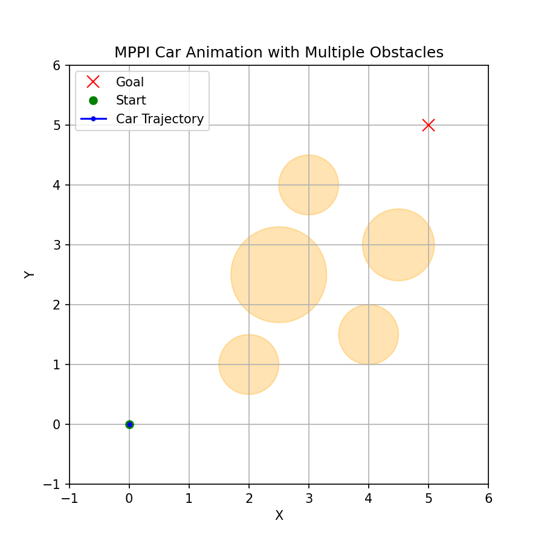

# mppi-2d-car-navigation-with-obstacles

A Python-based demonstration of **Model Predictive Path Integral (MPPI)** control for navigating a simple 2D car model around multiple circular obstacles. This repository showcases how to implement MPPI to minimize a custom cost function while avoiding collisions, and includes an animated Matplotlib visualization of the resulting trajectory.



## Features

- **2D car dynamics**: A simple kinematic model with constant forward velocity and steering angle control.  
- **MPPI planning**: Generates multiple control (steering) sequences, rolls them out, computes costs, and uses weighted samples to refine control.  
- **Collision avoidance**: Penalizes collisions with circular obstacles scattered in the environment.  
- **Animation**: Visualizes the car’s path, obstacles, and goal state.

## Requirements

- Python 3.x
- [NumPy](https://numpy.org/)
- [Matplotlib](https://matplotlib.org/)

To install the required libraries via pip:

```bash
pip install numpy matplotlib
```

## Usage
Clone or download this repository:
```bash
git clone https://github.com/taherfattahi/mppi-2d-car-navigation-with-obstacles.git
```

Navigate into the project directory:
```bash
cd mppi-2d-car-navigation-with-obstacles
```
Run the main script to see the animation:
```bash
python mppi_2d_car_navigation.py
```

When you run the script, a Matplotlib window will appear, showing:

- The start state (green dot)
- The goal state (red “x”)
- Obstacles (orange circles)
- The computed trajectory (blue line)

Each iteration of the MPPI planner selects a control sequence, rolls out, and updates the car’s path until the goal is reached.

## Code Structure
- ```car_dynamics(state, steering_angle, dt, v)```
Simple car model that updates position and heading based on the current steering angle and velocity.

- ```compute_cost(states, goal, obstacles, penalty)```
Calculates the cost of a trajectory, penalizing collisions and final distance to goal.

- ```mppi_iteration(...)```
The core MPPI step: generates random control sequences, rolls them out, computes costs, and computes weighted averages.

- ```run_mppi_control_loop(...)```
Runs multiple MPPI iterations in a loop to drive from the initial to the goal state.

- ```main_animation_demo()```
Sets up the problem (initial state, goal state, obstacles) and runs the MPPI loop. Renders an animation of the car’s path.

## Customization
- Obstacle configuration: You can add, remove, or change ```obstacles``` in the obstacles list.
- Car speed and steering: Adjust the velocity ```v``` or the random steering distribution to see different behaviors.
- Cost function: Change penalty values or the cost term to account for intermediate states, time cost, etc.

## License
This project is released under the <b>MIT License</b>. Feel free to use, modify, and distribute for your own projects.

## Resources

- [Model Predictive Path Integral (MPPI) - A Quick Introduction](https://dilithjay.com/blog/mppi)
- [Model Predictive Path Integral (MPPI) Control in C++](https://markus-x-buchholz.medium.com/model-predictive-path-integral-mppi-control-in-c-b13ea594ca20)
- [ROS TurtleBot Navigation from Scratch](https://github.com/bostoncleek/ROS-Turtlebot-Navigation/tree/master)
